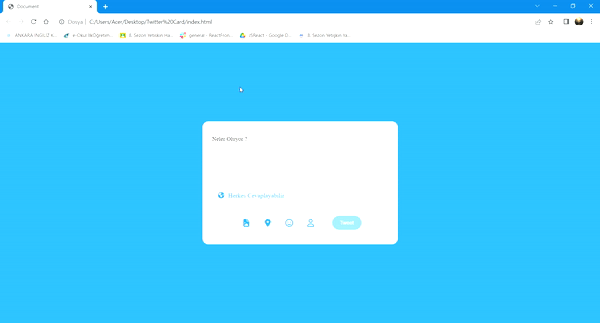

<h1> Twitter-Card </h1>

I created a twitter card with HTML, CSS and JS. I enabled the tweet button to be active when the text is written. I set a character limit. I ensured that the background of the letters and the counter would be red when this limit was exceeded.

<h2> Used Technologies </h2>

<h2> SCREENSHOT </h2>

